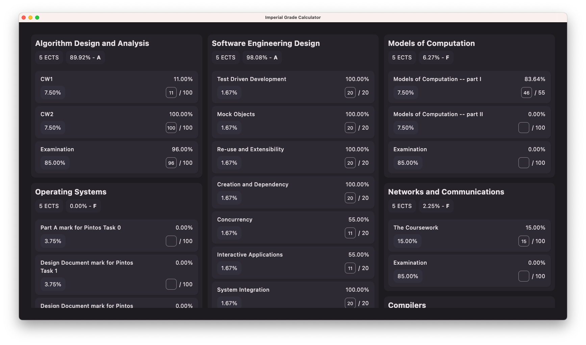
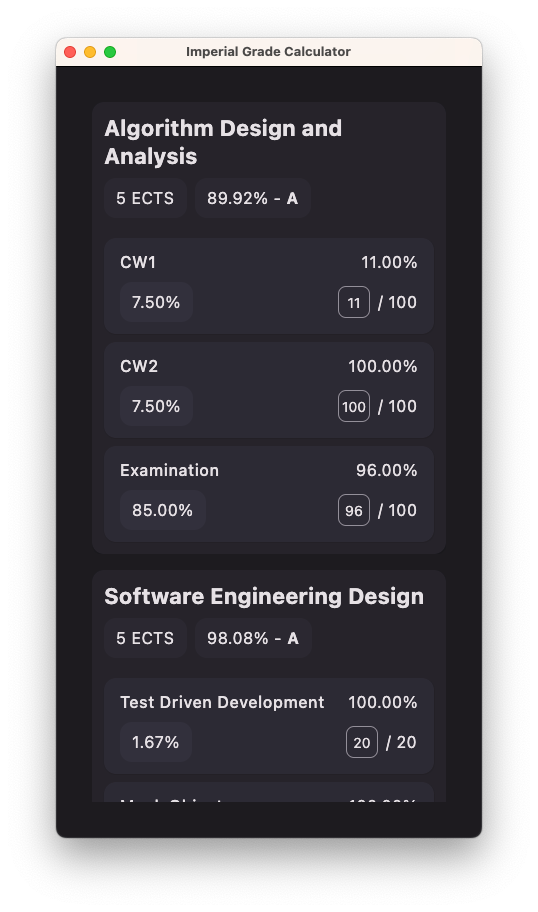

# Imperial College Grade Calculator

WIP, currently only supports Computing Year 2.

## Screenshots

### Desktop - Wide Window



### Desktop / Android - Narrow Window



### Android

## Build

To run desktop APP: (supports macOS, Windows, and Linux)

```shell
./gradlew runRelease
```

To build Android APP: (Android API 26+)

```shell
./gradlew :android:build
```

You can find the output APK in `android/build/outputs/apk`.

To install the debug variant to a device connected to ADB:

```shell
./gradlew :android:installDebug
```